# RutonyPad

Небольшая беспроводная BLE-клавиатура на 8 кнопок для управления OBS и другими горячими клавишами. Проект вырос из идеи “сделать за пару часов подарок”, а в итоге прошел через китайский клон nRF52840, тестер пинов, несколько версий корпуса, пайку, веб-конфигуратор и отдельный режим настройки.

<a href="assets/images/69.jpg">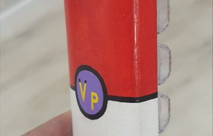</a>
<a href="assets/images/71.jpg">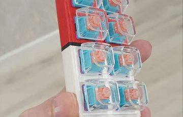</a>

## Что внутри

- прошивка устройства: [firmware/RutonyPad10/RutonyPad10.ino](firmware/RutonyPad10/RutonyPad10.ino);
- тестер пинов для китайского nRF52840 Pro Micro: [firmware/TesterPins/TesterPins.ino](firmware/TesterPins/TesterPins.ino);
- веб-страница для настройки клавиш: [web/index.html](web/index.html);
- STL-модель корпуса: [assets/models/RutonyPad-Box-v3.2.stl](assets/models/RutonyPad-Box-v3.2.stl);
- STL-крышки/клавиш: [assets/models/RutonyPad-Buttons-v1.1.stl](assets/models/RutonyPad-Buttons-v1.1.stl);
- фотографии процесса и схемы: [assets/images](assets/images).

Полезные внешние ссылки:

- схема устройства в Cirkit Designer: <https://app.cirkitdesigner.com/project/74aa2c99-3412-43d3-a665-44ffdaccba8f>;
- корпус в Tinkercad: <https://www.tinkercad.com/things/2l7U8HlfgIG-rutonypad-v31>.

## Как пользоваться

1. Залить прошивку [RutonyPad10.ino](firmware/RutonyPad10/RutonyPad10.ino) на nRF52840.
2. Подключить кнопки к пинам: `D33`, `D2`, `D20`, `D21`, `D23`, `D1`, `D12`, `D11`.
3. Подключить делитель батареи к `D18`.
4. В обычном режиме использовать устройство как Bluetooth-клавиатуру.
5. Для настройки зажать крайние кнопки примерно на 5 секунд.
6. Открыть [web/index.html](web/index.html) в браузере с поддержкой Web Bluetooth.
7. Настроить клавиши и вернуться в режим клавиатуры.

## Что получилось

Получилось маленькое беспроводное устройство на 8 клавиш, которое:

- работает как BLE HID-клавиатура;
- умеет показывать заряд батареи;
- живет от аккумулятора примерно 2,5-3 недели;
- переключается в отдельный режим конфигурации комбинацией крайних кнопок по диагонали;
- один режим работает как клавиатура (RutonyPad), второй работает как конфигуратор и может подключиться к веб-странице для настройки (RutonyCfg);
- настраивается через веб-страницу без перепрошивки;
- собрано в напечатанном корпусе.

## Идея

Все началось на стриме у Хели: <https://twitch.tv/vpaname>. Она любит танцевать, но управлять компьютером, когда стоишь, не очень удобно. Нужна была мини-клавиатура для OBS и горячих клавиш.

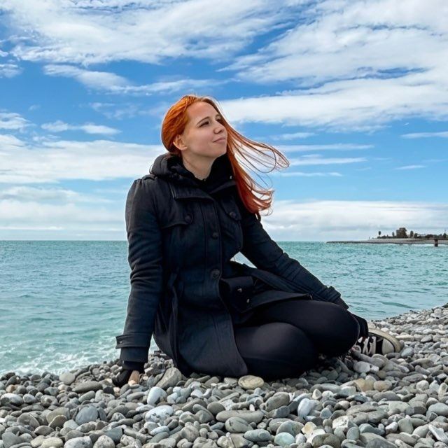

Быстрый поиск показал, что готовые устройства существуют, но стоят ощутимо дороже, чем хотелось. Я прикинул бюджет в районе 2-3 тысяч рублей и решил сделать свою версию. До дня рождения оставалось около трех месяцев, так что идея выглядела как хороший подарок и проект “буквально на пару часов”. По итогу, конечно, эти “пара часов” превратились в 3 месяца безудержного веселья. Но было интересно попробовать себя в роли инженера, коим я и являюсь. Опыт есть в создании устройств, но они в основном были в разы проще и не такие комплексные. 

## Контроллер и первые грабли

После общения с нейронкой стало казаться, что задача простая: нужна небольшая плата, Bluetooth, несколько кнопок и аккумулятор. Wi-Fi не нужен, основа устройства - контроллер.

Я заказал на Ozon модуль NRF52840, совместимый с Nice!Nano V2.0 / Bluetooth Pro Micro NRF52840. С AliExpress ждать пришлось бы дольше, да и было непонятно, что именно приедет.

<a href="assets/images/2.webp">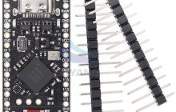</a>

Пока плата ехала, я прикинул корпус:

<a href="assets/images/3.jpg">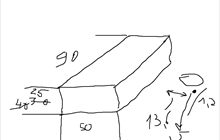</a>

Когда контроллер приехал, начались первые тесты в Arduino IDE. Задачи были две: написать прошивку и потом все это спаять. На макетной плате все вело себя отвратительно: то работает, то отваливается, то кажется, что ошибка в коде, то кажется, что в проводах.

<a href="assets/images/4.jpg">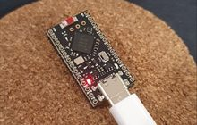</a>
<a href="assets/images/5.jpg">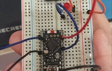</a>
<a href="assets/images/6.jpg">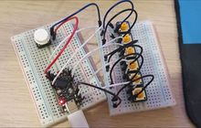</a>

В итоге выяснилось, что часть проблем была в макетной плате. Эти платы удобны для быстрых проверок, но если контакт плохой, начинается настоящая лотерея. А еще обнаружилась проблема с самим китайским клоном контроллера.

В комплекте была схема пинов, но нигде не было сказано, что часть пинов не работает или имеет другую нумерацию. Несколько дней ушло на ковыряние неочевидных проблем.

<a href="assets/images/7.webp">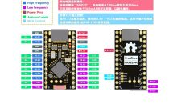</a>

Чтобы разобраться, я написал отдельный скетч-тестер. Он сканирует пины: я замыкаю их на GND и смотрю, какой пин реально отзывается. Так стало понятно, что на китайском клоне половина заявленных пинов действительно может оказаться бесполезной.

<a href="assets/images/8.png">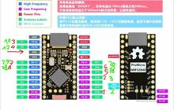</a>

Скетч тестера лежит здесь: [firmware/TesterPins/TesterPins.ino](firmware/TesterPins/TesterPins.ino).

## Прошивка

Прошивку сначала помогала собирать нейронка, но она честно наворотила ровно то, что я попросил: 8 кнопок, Bluetooth и отдельную кнопку включения. Проблема была в том, что часть выбранных пинов не работала, а отдельная кнопка питания в итоге оказалась не такой уж нужной.

Пока я правил прошивку, появилась идея использовать служебную комбинацию кнопок для перехода в режим настройки. Логика получилась такая:

- в обычном режиме устройство работает как BLE HID-клавиатура;
- если зажать две крайние кнопки примерно на 5 секунд, устройство перезагружается в режим конфигурации;
- в режиме конфигурации оно не создает HID-клавиатуру, зато его можно настроить через веб-страницу;
- повторная служебная комбинация или кнопка на странице возвращает устройство в обычный режим.

Еще одна важная доработка - отображение заряда аккумулятора в Bluetooth-устройствах. Для этого пришлось отказаться от отдельной кнопки питания, поставить резисторы и снимать показания с контроллера заряда. Зато теперь в системе видно процент батареи.

По умолчанию устройство большую часть времени спит. Сон почти не ест аккумулятор. По расчетам и в реальности автономность получилась примерно 2,5-3 недели.

Основная прошивка лежит здесь: [firmware/RutonyPad10/RutonyPad10.ino](firmware/RutonyPad10/RutonyPad10.ino).

## Компоненты

Основные детали, которые использовались:

- модуль NRF52840, совместимый с Nice!Nano V2.0 / Bluetooth Pro Micro NRF52840;
- аккумулятор 602035, 500 mAh, 3,7 V;
- контроллер заряда TP4056 USB Type-C с защитой;
- кабели JST PH 2.0 мм;
- свитчи Redragon Bullet-R;
- сокеты Kailh MX Socket, чтобы не паять свитчи намертво;
- паяльник ALIENTEK T90B;
- припой ПОС-61 с канифолью.

Паяльник, кстати, оказался очень удачным: быстрый разогрев за 5-10 секунд, питание от обычного повербанка, настройка температуры и удобная ручка. Важный момент: нужен мягкий USB-C кабель под высокий вольтаж. В комплекте он был.

## Схема

Финальная схема подключения компонентов:

<a href="assets/images/9.png">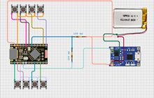</a>

Проект схемы: <https://app.cirkitdesigner.com/project/74aa2c99-3412-43d3-a665-44ffdaccba8f>

Изначально в схеме была отдельная кнопка включения и программирования, но позже я от нее отказался.

<a href="assets/images/10.jpg">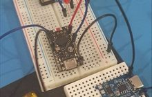</a>

## Пайка и первые тесты

Когда прошивка, схема и веб-страница для программирования клавиш были готовы, началась пайка.

Сначала припаивается силовой провод. Тут важно сделать все аккуратно: ничего не должно торчать, все закрывается оплеткой.

<a href="assets/images/11.jpg">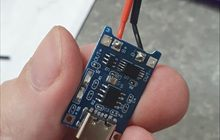</a>

Потом первые тесты: устройство уже видно в компьютере без прямого подключения. На заднем плане еще старая схема с отдельной кнопкой включения.

<a href="assets/images/12.jpg">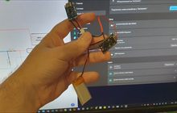</a>

Дальше - пайка всего устройства. Почти сразу стало понятно, что без “третьей руки” будет тяжело: контакты мелкие, плату нужно держать, а видеть хочется больше. Лупа с зажимами сильно упростила жизнь.

<a href="assets/images/13.jpg">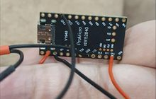</a>
<a href="assets/images/14.jpg">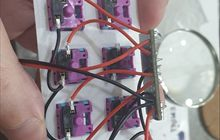</a>
<a href="assets/images/15.jpg">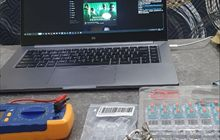</a>
<a href="assets/images/16.jpg">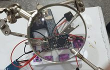</a>
<a href="assets/images/17.jpg">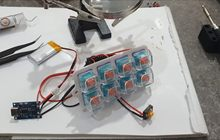</a>
<a href="assets/images/18.jpg">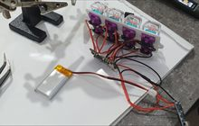</a>
<a href="assets/images/19.jpg">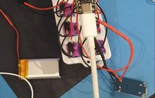</a>

## Веб-конфигуратор

Для настройки клавиш сделана отдельная страница: [web/index.html](web/index.html).

Она подключается к устройству в режиме конфигурации через Web Bluetooth и позволяет назначать поведение кнопок. После настройки можно вернуть устройство в режим клавиатуры прямо со страницы.

## Корпус

Отдельная глава боли - корпус и покраска.

Сначала я сделал корпус высотой 40 мм, но после печати стало понятно, что он смотрится плохо: слишком высокий, плюс при печати лежа появились “лесенки”. Тогда я решил печатать стоя и уменьшил высоту до 25 мм.

<a href="assets/images/Корпус.png">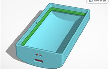</a>

Модель в Tinkercad: <https://www.tinkercad.com/things/2l7U8HlfgIG-rutonypad-v31>

Версий корпуса было несколько. То нужна полка для контроллера заряда, то больше места под крышку, то защелки получаются слишком хлипкими. Всего модель печаталась 11 раз, до конца печати дожили 4 версии. В одном из заходов даже сломался принтер: датчик температуры сопла показывал постоянные 220 градусов.

<a href="assets/images/21.jpg">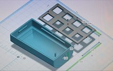</a>
<a href="assets/images/22.jpg">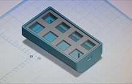</a>
<a href="assets/images/23.jpg">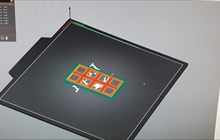</a>
<a href="assets/images/24.jpg">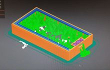</a>
<a href="assets/images/25.jpg">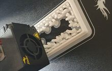</a>
<a href="assets/images/26.jpg">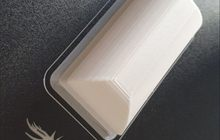</a>
<a href="assets/images/27.jpg">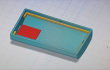</a>

В итоге корпус все-таки напечатался. Как выяснилось позже, это был только второй корпус.

<a href="assets/images/28.png">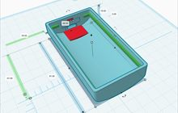</a>
<a href="assets/images/29.jpg">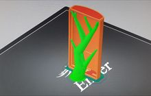</a>
<a href="assets/images/30.jpg">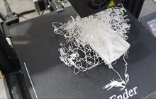</a>
<a href="assets/images/31.jpg">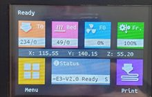</a>
<a href="assets/images/32.jpg">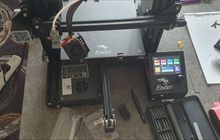</a>
<a href="assets/images/33.jpg">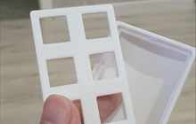</a>

Дальше пошла отделка: шкурка, грунтовка, снова шкурка, покраска акрилом. Опыта было ноль, поэтому сначала вышло плохо. Потом после советов и мучений выяснилось, что губка дает более приятный результат.

Но появилась шагрень - мелкие неровности поверхности. Для устройства, которое хочется держать в руке, это неприятно. Я надеялся, что лак выровняет покрытие. Не выровнял. Там, где поверхность была гладкой, все стало красиво, а там, где была шагрень, стало еще хуже.

<a href="assets/images/34.jpg">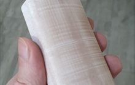</a>
<a href="assets/images/35.jpg">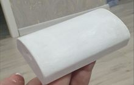</a>
<a href="assets/images/36.jpg">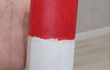</a>
<a href="assets/images/37.jpg">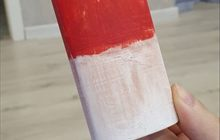</a>
<a href="assets/images/38.jpg">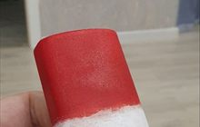</a>
<a href="assets/images/39.jpg">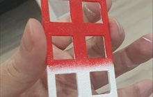</a>
<a href="assets/images/40.jpg">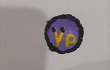</a>
<a href="assets/images/41.jpg">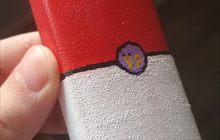</a>
<a href="assets/images/42.jpg">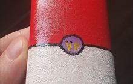</a>

Пришлось печатать еще раз. Потом снова шкурить, шпаклевать, красить, ждать между слоями, покрывать лаком и сушить. В этот раз я уже выдерживал паузы дольше: между слоями краски около 2 часов, между слоями лака около 4 часов, потом сутки на сушку.

<a href="assets/images/43.jpg">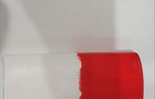</a>
<a href="assets/images/44.jpg">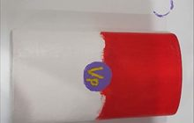</a>
<a href="assets/images/45.jpg">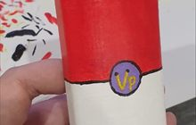</a>

И тут новая проблема: модель все еще слегка липкая, а после сушки в гардеробе белая часть облепилась ворсинками. Гардероб оказался худшим местом для сушки свежего лака.

<a href="assets/images/46.jpg">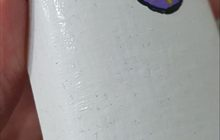</a>

На этом моменте я сдался и позвал тяжелую артиллерию - Леру: <https://twitch.tv/solodvalery>. Для нее была напечатана еще одна модель, а вместе с ней отправились лаки, краски, грунтовки, шкурки и все остальное для нормальной покраски.

Было решено капитально переделать способ печати: выставить максимальные режимы сглаживания, спаивания и поддержек. Я просто устал от бесконечного брака. Поэтому напечатал модель под углом, чтобы она была максимально крепкой.

<a href="assets/images/47.jpg">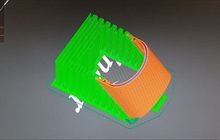</a>
<a href="assets/images/48.jpg">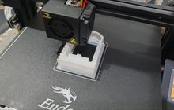</a>

Лере были отправлены все мои поделки, в том числе пара из многочисленных неудачных печатей.

Она зашкурила и покрыла корпус грунтом, а потом наметила логотип. Правда, логотип оказался неправильным, а пока мы переписывались, из-за моего сбитого режима он уже был покрашен неверно. Поэтому решили поправить его прямо на уже покрашенной модели. Но в любом случае получилось аккуратно.

Итак, корпус готов. Выглядит отлично. Гораздо лучше, чем мои поделки. Сразу видно, что у Леры есть опыт.

## Финальная сборка

Что ж, пришло время собирать устройство. Ставим свитчи. Ставим контроллер заряда и запаиваем его пластиком, чтобы он не болтался, а еще был упор: время от времени на него будет давить USB-C при зарядке. Добавляем термостойкую изоленту. Не уверен, что она тут обязательна, но пусть будет.

Добавляем аккумулятор и приклеиваем его термостойким скотчем. Он все же тяжеловат и может болтаться, поэтому фиксируем аж несколько раз. Пластиком не запаивал: нужен вариант замены. И добавляем петельку на руку.

Теперь выравниваем провода и состыковываем крышку с корпусом. Верхняя крышка специально делалась без зазора в миллиметр, чтобы ее можно было просто поставить и не клеить. А если что-то понадобится поправить, корпус можно вскрыть: снять свитч и аккуратно вытянуть крышку со свитчами. Ставим прозрачные кейкапы.

Итоговый результат.

